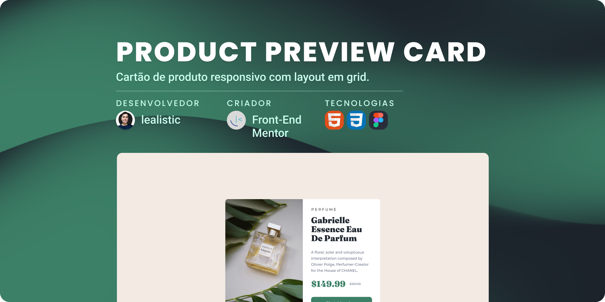

<h1 align="center">Product Preview Card</h1>

<!--Pontos de Navegação-->

  <a href="#-tecnologias">Tecnologias</a>&nbsp;&nbsp;&nbsp;|&nbsp;&nbsp;&nbsp;
  <a href="#-projeto">Projeto</a>&nbsp;&nbsp;&nbsp;|&nbsp;&nbsp;&nbsp;
  <a href="#memo-licença">Licença</a>

  

 

  

## 🚀 Tecnologias

Esse projeto foi desenvolvido com as seguintes tecnologias:

📌 HTML5
📌 CSS3
📌 Figma

## 💻 Projeto

Desafio prático do Front-End Mentor que consistiu na criação de um cartão de produto responsivo utilizando CSS Grid para estruturação do layout. Durante o processo:

✔ **Figma** para reprodução fiel do design com base em uma imagem de referência;

✔ **HTML semântico** para organização clara e acessível do conteúdo;

✔ **CSS Grid e Flexbox** para alinhamento preciso e adaptabilidade;

✔ **Media Queries** para ajustes de layout e imagens em diferentes tamanhos de tela;

✔ **Acessibilidade** reforçada com atributos como `aria-labelledby` para melhor experiência em leitores de tela.

🔗 [Link para acesso ao desafio](https://www.frontendmentor.io/challenges/product-preview-card-component-GO7UmttRfa)

🔗 [Acesse o projeto finalizado, online](https://lealistic.github.io/fdmentor-productcard/)

## 📝 Licença

Esse projeto está sob a licença MIT.
